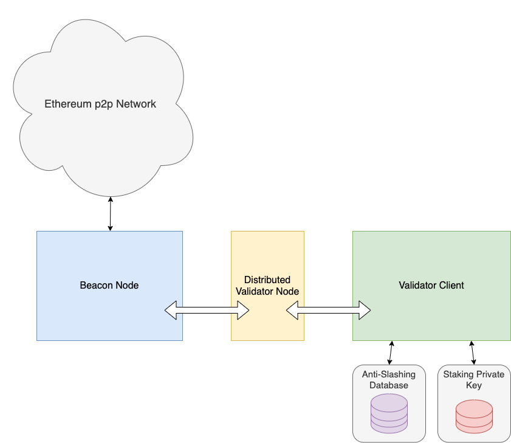

# Ethereum Distributed Validator Specification

Distributed Validators (DV) are a technique for distributing the job of an Ethereum validator among a set of distributed nodes in order to improve resilience (safety, liveness, or both) as compared to running a validator client on a single machine.

## Introduction

### Motivation

#### Traditional Validator Client Setup
Ethereum validators participate in the [proof-of-stake (PoS) protocol](https://github.com/ethereum/consensus-specs) by signing messages (such as blocks or attestations) using their staking private key. The staking key is accessible only by the validator client software, which schedules the creation & signing of messages according to the duties assigned to the validator. Some risks involved in a traditional validator client setup are:
- The staking private key resides in one location. If an adversary gains access to this key, it can create conflicting messages that result in slashing of the validator's deposit.
    - Stakers who do not operate their own validator need to hand over their staking private key to the operator. They must trust the operator for the security of their staking private key.
- If the validator client software is unable to create timely messages to perform validator duties, the validator suffers an inactivity leak that reduces its balance.
    - This could happen due to causes such as software crashes, loss of network connection, hardware faults, etc.
- If the Beacon Node to which the validator client is connected has a fault, a validator may end up following a minority fork resulting it appearing to be offline to the rest of the PoS protocol.

#### Distributed Validator Protocol
The Distributed Validator protocol presents a solution to mitigate the risks & concerns associated with traditional, single Validator Client setups. In addition, this protocol can be used to enable advanced staking setups such as decentralized staking pools.

### Basic Concepts

**Note**: Refer to the [glossary](glossary.md) for an explanation of new terms introduced in the Distributed Validator specifications.

The two fundamental concepts behind Distributed Validators are:
- **consensus**: the responsibilities of a single validator are split among several co-validators, who must work together to reach agreement on how to vote before signing any message.
- ***M-of-N* threshold signatures**: the validator's staking key is split into *N* pieces and each of the co-validators holds a share. When at least *M* of the co-validators reach consensus on how to vote, they each sign the message with their share and a combined signature can be reconstructed from the shares.

Ethereum proof-of-stake uses the BLS signature scheme, in which the private keys can be *M-of-N* secret-shared (using Shamir secret sharing) to implement *M-of-N* threshold signatures.

By combining a suitable (safety-favouring) consensus algorithm with an *M-of-N* threshold signature scheme, the DV protocol ensures that agreement is backed up by cryptography and at least *M* co-validators agree about any decision.

### Resources

#### Formal specification and verification

The formal specification and verification of the Distributed Validator technology are currently being developed [here](https://github.com/ConsenSys/distributed-validator-formal-specs-and-verification).

#### Implementations

The following are existing implementations of Distributed Validator technology (but not necessarily implementations of this specification).

- [`python-ssv`](https://github.com/dankrad/python-ssv): A proof-of-concept implementation of the distributed validator protocol in Python that interacts with the [Prysm Ethereum client](https://github.com/prysmaticlabs/prysm).
- [`ssv`](https://github.com/bloxapp/ssv): A Go implementation of the DV protocol that interacts with the [Prysm Ethereum client](https://github.com/prysmaticlabs/prysm).
- [`charon`](https://github.com/ObolNetwork/charon): An HTTP middleware client in Go that implements the DV protocol.

#### Documents
- [Distributed Validator Architecture Video Introduction](https://www.youtube.com/watch?v=awBX1SrXOhk)

### General Architecture

This specification presents a way to implement Distributed Validator Client software as middleware between the Beacon Node (BN) and a [Remote Signer (RS)](https://github.com/ConsenSys/web3signer):
- all communication between the BN and RS is managed by the DVC in order for it to provide the additional DV functionality.
- the BN & RS are unaware of the presence of the DVC, i.e., they think they are connected to each other as usual.

### Assumptions
- We assume *N* total nodes and an *M-of-N* threshold signature scheme.
    - For general compatibility with BFT consensus protocols, we assume that `M = ceil(2 * N / 3)`.
- This specification assumes [some leader-based safety-favoring consensus protocol](src/dvspec/consensus.py) for the Co-Validators to decide on signing upon the same attestation/block. We assume that the consensus protocol runs successfully with *M* correct nodes, no more than `F = (N-1)/3` Byzantine nodes and no more than `N - M - F` fail-stop nodes out of *N* total nodes.
- We assume the usual prerequisites for safe operation of the Validator Client, such as an up-to-date anti-slashing database, correct system clock, etc.
- We disregard the voting on the "correct" Ethereum fork for now - this functionality will be added in a future update.

### Desired Guarantees
- **Safety (against key theft)**:
    - The Validator's staking private key is secure unless security is compromised at more than *M* of the *N* Co-Validators.
- **Safety (against slashing)**: 
    - Under the assumption of an asynchronous network, the Validator is never slashed unless more than 1/3rd of the Co-Validators are Byzantine.
    - Under the assumption of a synchronous network, the Validator is never slashed unless more than 2/3rds of the Co-Validators are Byzantine.
- **Liveness**: The protocol will eventually produce a new attestation/block under partially synchronous network unless more than 1/3rd of the Co-Validators are Byzantine.

## Specification

Technical details about the specification are described in [`src/dvspec/`](src/dvspec/).
