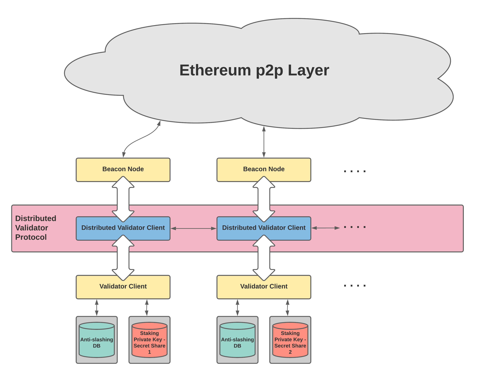

# Ethereum Distributed Validator Specification

Distributed Validators (DV) are a technique for distributing the job of an Ethereum validator among a set of distributed nodes in order to improve resilience (safety, liveness, or both) as compared to running a validator client on a single machine.

## Introduction

### Motivation

#### Traditional Validator Client Setup
Ethereum validators participate in the [proof-of-stake (PoS) protocol](https://github.com/ethereum/consensus-specs) by signing messages (such as blocks or attestations) using their staking private key. The staking key is accessible only by the validator client software, which schedules the creation & signing of messages according to the duties assigned to the validator. Some risks involved in a traditional validator client setup are:
- The staking private key resides in one location. If an adversary gains access to this key, it can create conflicting messages that result in slashing of the validator's deposit.
    - Stakers who do not operate their own validator need to hand over their staking private key to the operator. They must trust the operator for the security of their staking private key.
- If the validator client software is unable to create timely messages to perform validator duties, the validator suffers an inactivity leak that reduces its balance.
    - This could happen due to causes such as software crashes, loss of network connection, hardware faults, etc.
- If the Beacon Node to which the validator client is connected has a fault, a validator may end up following a minority fork resulting it appearing to be offline to the rest of the PoS protocol.

#### Distributed Validator Protocol
The Distributed Validator protocol presents a solution to mitigate the risks & concerns associated with traditional, single Validator Client setups. In addition, this protocol can be used to enable advanced staking setups such as decentralized staking pools.

### Basic Concepts

The two fundamental concepts behind Distributed Validators are:
- **consensus**: the responsibilities of a single validator are split among several co-validators who must work together to reach agreement on how to vote before doing so
- **threshold signatures**: the validator's staking key is split into *N* pieces and each of the co-validators holds a share. When at least *M* of the co-validators reach consensus on how to vote, they each sign the message with their share and a combined signature can be reconstructed from the shares. (this is known as *(M,N)-* threshold signatures).

Ethereum proof-of-stake uses the BLS signature scheme, in which the private keys can be *(M,N)-* secret-shared to implement *(M,N)-* threshold signatures.

**Note**: Refer to the [glossary](glossary.md) for an explanation of new terms introduced in the Distributed Validator specifications.

By combining a (safety-favouring) consensus algorithm with a threshold signature scheme, the DV protocol ensures that agreement is backed up by cryptography and at least *M* co-validators agree about any decision.

### Resources

#### Implementations

The following are existing implementations of DIstributed Validator technology (but not necessarily implementations of this specification).

- [`python-ssv`](https://github.com/dankrad/python-ssv): A proof-of-concept implementation of the distributed validator protocol in Python that interacts with the [Prysm Ethereum client](https://github.com/prysmaticlabs/prysm).
- [`ssv`](https://github.com/bloxapp/ssv): An implementation of the distributed validator protocol in Go that interacts with the [Prysm Ethereum client](https://github.com/prysmaticlabs/prysm).

#### Documents
- [Distributed Validator Architecture Video Introduction](https://www.youtube.com/watch?v=awBX1SrXOhk)

### General Architecture

This specification presents a way to implement Distributed Validator Client software as middleware between the Beacon Node (BN) and Validator Client (VC). That is to say that the connected BN thinks it is talking to a "normal" VC and the VC acts as though it is connected to a "normal" BN where as in reality, all communication is being intercepted by the DV in order for it to provide all the additional functionality.

### Desired Guarantees
- **Safety (against key theft)**:
    - The Validator's staking private key is secure unless security is compromised at more than *M* of the *N* Co-Validators.
- **Safety (against slashing)**: 
    - Under the assumption of an asynchronous network, the Validator is never slashed unless more than 2/3rd of the Co-Validators are Byzantine.
    - Under the assumption of a synchronous network, the Validator is never slashed unless more than 1/3rd of the Co-Validators are Byzantine.
- **Liveness**: The protocol will eventually produce a new attestation/block under partially synchronous network unless more than 1/3rd of the Co-Validators are Byzantine.

### Assumptions
- This specification assumes [some leader-based safety-favoring consensus protocol](src/dvspec/consensus.py) for the Co-Validators to decide on signing upon the same attestation/block.
- We assume the prerequisites for safe operation of the Validator Client, such as an up-to-date anti-slashing database, correct system clock, etc.
- We disregard the voting on the "correct" Ethereum fork for now - this functionality will be added in a future update.

## Spec

The specifications are organized as follows:
- The [distributed validator specification](src/dvspec/spec.py) defines the behavior of a Co-Validator regarding attestation & block production processes.
- The [Ethereum node interface](src/dvspec/eth_node_interface.py) describes the interface to communicate with the associated Beacon Node & Validator Client.
- The [consensus specification](src/dvspec/consensus.py) describes the basic structure for the consensus protocol used between Co-Validators.
- The [networking specification](src/dvspec/networking.py) defines the required networking logic between Distributed Validator Clients.

### Attestation Production Process

### Block Production Process

