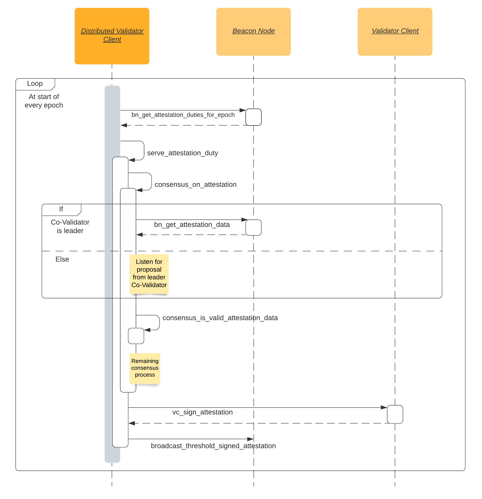

# Ethereum Distributed Validator Specification

Distributed Validators allow for implementing an Ethereum validator using a set of distributed nodes in a way that improves the resilience as compared to running a client on a single machine.

## Introduction

This specification presents a way to implement Distributed Validator software as middleware between the Beacon Node and Validator Client. 

### Desired Guarantees
- Safety: Validator is never slashed unless `X` fraction of the Validator Client nodes are Byzantine, even under asynchronous network
- No Deadlock: The protocol never ends up in a deadlock state where no progress can be made
- Liveness: The protocol will eventually produce a new attestation/block, under partially synchronous network

### Assumptions
- This specification assumes [some leader-based consensus protocol](src/dvspec/consensus.py) for the DV nodes to decide on signing upon the same attestation/block.
- We disregard the voting on the "correct" Ethereum fork for now - this functionality will be added in a future update.

### Design Rationale
- Validity of attestation data must be checked against the slashing DB at the beginning of the consensus process
- If the consensus process returns an attestation, then the slashing DB must allow it at that time
- There can only be one consensus process running at any given moment
- Slashing DB cannot be updated when a consensus process is running
- Consensus processes for attestation duties must be spawned in increasing order of slot

## Spec

The distributed validator [specification](src/dvspec/spec.py) defines the behavior of the distributed validator regarding attestation & block production processes. It utilizes the [standard Ethereum node interface](src/dvspec/eth_node_interface.py) to communicate with the associated Beacon Node & Validator Client.

### Attestation Production Process

### Block Production Process

