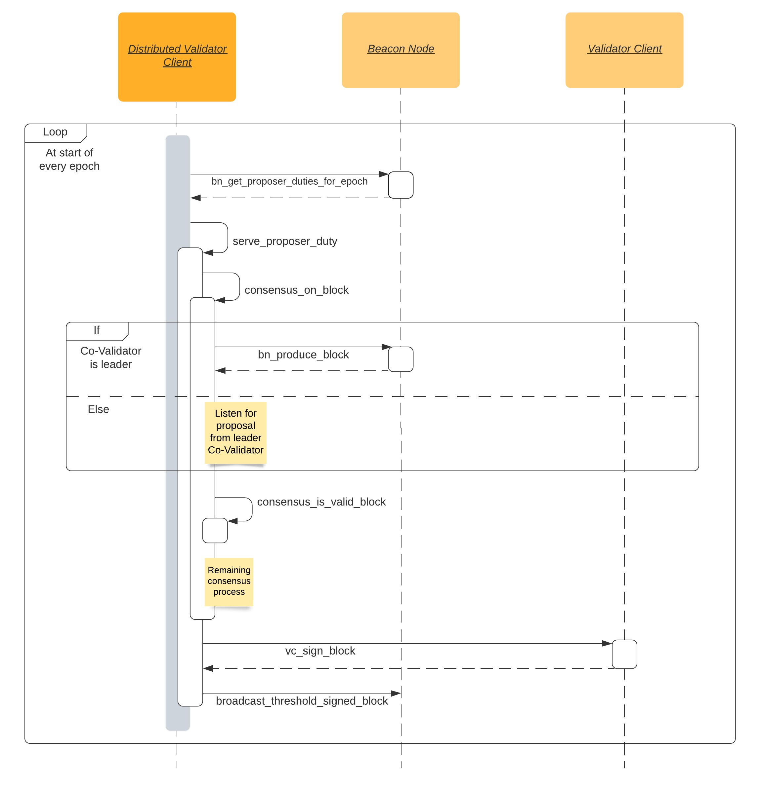

# Ethereum Distributed Validator Specification

Distributed Validators allow for implementing an Ethereum validator using a set of distributed nodes in a way that improves the resilience as compared to running a client on a single machine.

## Introduction

### Motivation
Ethereum validators participate in the proof-of-stake protocol by signing messages (such as blocks or attestations) using their staking private key. The staking key is accessible only by the validator client software, which schedules the creation & signing of messages according to the duties assigned to the validator. Some risks involved in a traditional validator client setup are:
- The staking private key resides in one location. If an adversary gains access to this key, it can create conflicting messages that result in slashing of the validator's deposit.
    - Stakers who do not operate their own validator need to hand over their staking private key to the operator. They must trust the operator for the security of their staking private key.
- If the validator client software is unable to create timely messages to perform validator duties, the validator suffers an inactivity leak that reduces its balance.
    - This could happen due to causes such as software crashes, loss of network connection, hardware faults, etc.

The Distributed Validator protocol presents a mitigation to the risks & concerns mentioned above. In addition, this protocol can be used to enable advanced staking setups such as decentralized staking pools.

### General Architecture

This specification presents a way to implement Distributed Validator Client software as middleware between the Beacon Node and Validator Client. 

**Note**: Refer to the [glossary](glossary.md) for an explanation of new terms introduced in the Distributed Validator specifications.

### Desired Guarantees
- Safety: 
    - Under the assumption of an asynchronous network, the Validator is never slashed unless more than 2/3rd of the Co-Validators are Byzantine.
    - Under the assumption of a synchronous network, the Validator is never slashed unless more than 1/3rd of the Co-Validators are Byzantine.
- No Deadlock: The protocol never ends up in a deadlock state where no progress can be made
- Liveness: The protocol will eventually produce a new attestation/block, under partially synchronous network

### Assumptions
- This specification assumes [some leader-based consensus protocol](src/dvspec/consensus.py) for the DV nodes to decide on signing upon the same attestation/block.
- We disregard the voting on the "correct" Ethereum fork for now - this functionality will be added in a future update.

### Design Rationale
- Validity of attestation data must be checked against the slashing DB at the beginning of the consensus process
- If the consensus process returns an attestation, then the slashing DB must allow it at that time
- There can only be one consensus process running at any given moment
- Slashing DB cannot be updated when a consensus process is running
- Consensus processes for attestation duties must be spawned in increasing order of slot

## Spec

The distributed validator [specification](src/dvspec/spec.py) defines the behavior of the distributed validator regarding attestation & block production processes. It utilizes the [standard Ethereum node interface](src/dvspec/eth_node_interface.py) to communicate with the associated Beacon Node & Validator Client.

### Attestation Production Process

### Block Production Process

