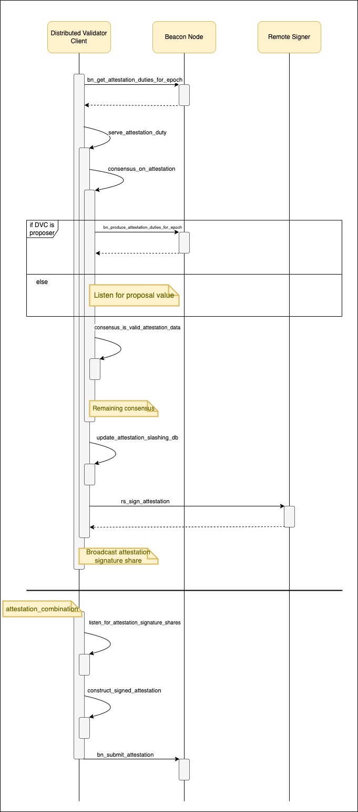

# Ethereum Distributed Validator Specification

## Organization

The specifications are organized as follows:
- [`spec.py` - distributed validator specification](spec.py) defines the behavior of a Co-Validator regarding attestation & block production processes.
- [`eth_node_interface.py` - Ethereum node interface](eth_node_interface.py) describes the interface to communicate with the associated Beacon Node (BN) & Validator Client (VC).
- [`consensus.py` - consensus specification](consensus.py) describes the basic structure for the consensus protocol used between Co-Validators.
- [`networking.py` - networking specification](networking.py) defines the required networking logic between Distributed Validator Clients.
- [`utils/` - utilities](utils/) contain type definitions and misc. helper functions for the specification.

## Operation of Distributed Validator Client (DVC)

### Communication between DVC and VC
The BN & VC communicate over HTTP in accordance with the [Ethereum Beacon Node API](https://github.com/ethereum/beacon-APIs/). The DV protocol is designed such that the DVC can operate as middleware between the BN & VC. Both the BN & VC are unaware of the presence of the DVC - they communicate with the DVC as they would with each other.

The [interaction between the BN & VC](https://github.com/ethereum/beacon-APIs/blob/master/validator-flow.md) is driven by the VC, i.e., the VC starts the interaction by making the appropriate request at the BN's HTTP server. In this way, the VC never accepts incoming requests and does not host a server. The lack of a server prevents the DVC from instructing the VC to sign data whenever consensus is formed for a duty's data. The DVC instead caches the decided data for the duty, and responds to the VC's request for the duty's data using the cached value. If the DVC has not formed consensus over a duty's data when the VC makes a request for that duty's data, the HTTP request is "hung" until consensus is formed. This can be supported by the VC with appropriate parameter changes in the HTTP request it makes, without any implementation changes.

The basic operation of the DVC is as follows:
1. Request duties from the BN at the start of every epoch
2. Schedule serving of the received duties at the appropriate times
3. Serve a duty when triggered by:
    1. Forming consensus with other Co-Validators over the data to be signed
    2. Caching the decided data to provide to the VC's request for data to be signed for this duty, and responding to the VC's request using the cached data
    3. Capturing the threshold signed data from the VC's response and broadcasting it to other Co-Validators
    4. Re-combination of threshold signed data after receiving enough threshold signed data shares

### Anti-Slashing Measures at the DVC
VCs have an in-built slashing protection mechanism called the "slashing database" (a misnomer for "anti-slashing database"). The slashing database stores information about the messages that have been signed by the Validator. When new messages are to be signed, they are first checked against the slashing DB to ensure that a slashable pair of messages will not be produced (see - slashing rules for [attestations](https://github.com/ethereum/consensus-specs/blob/master/specs/phase0/beacon-chain.md#is_slashable_attestation_data) & [blocks](https://github.com/ethereum/consensus-specs/blob/master/specs/phase0/beacon-chain.md#proposer-slashings)). 

While forming consensus over data, it is essential for the DVC to check the validity of the data against this slashing DB. However, since the DVC does not have direct access to the VC's slashing DB, it has to maintain a local cache of its state. The slashing DB at the DVC operates as follows:
1. When initializing the setup, the DVC requires input about the state of the VC's slashing DB. When provided, the DVC will initialize a local slashing DB of its own with the given state.
2. While forming consensus, the DVC checks that the proposed consensus value is not slashable against its slashing DB.
3. When a consensus value is decided, the DVC adds the value to its slashing DB.

The initialization process can be carried out without change to the VC: with the VC and DVC shut down, manually export the VC's slashing DB and import it in the DVC. Automatic initialization of the DVC is not possible without changes to the VC implementation (this is a WIP feature in active discussion).

## Sequence Diagrams

### Attestation Production Process

### Block Production Process

